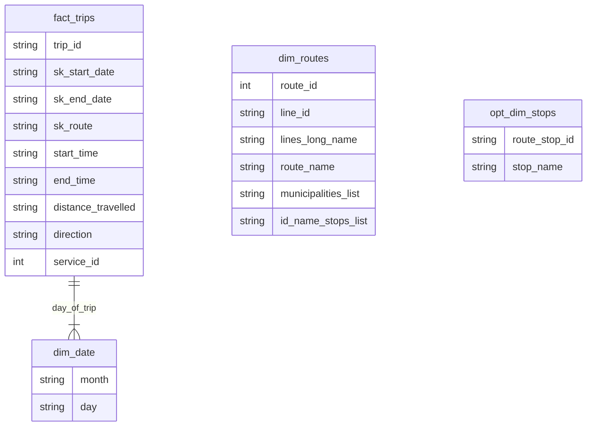

# CarrisInsight
## Data Engineering – Applied Project

## Project Overview
This project focuses on creating data pipelines to support a real-time dashboard for monitoring Carris bus positions and related data.

## Project Structure
* **dbt Models**: Data transformations for BigQuery.
* **Spark Jobs**: Real-time data processing.
* **Airflow DAGs**: Batch data workflow orchestration.

## Architecture

### Streaming Data Pipeline
* Spark Structured Streaming processes JSON files from the Carris API.
* Data is stored and processed using Google Cloud Storage (GCS).

### Batch Data Pipeline
* Apache Airflow orchestrates data extraction and transformation.
* Raw data is stored in GCS and transformed for BigQuery using dbt.

## Tools and Technologies
* Google Cloud Storage
* BigQuery
* Spark
* Airflow
* dbt
* Python

## Deliverables 
* Dashbaord mockup

## Optional Features
* Add extra data sources to enrich output:
   -- weather, traffic, cultural/social events, interest points 
* 

## Checklist 

## Checklist 

### Bucket for dags
 -  https://console.cloud.google.com/storage/browser/edit-de-project-airflow-dags/dags;tab=objects?authuser=1&invt=Abl7xA&project=data-eng-dev-437916&pli=1&prefix=&forceOnObjectsSortingFiltering=false

### Bucket for raw data dump and staging 
 - 

### Bucket for reading streaming data 
 - https://console.cloud.google.com/storage/browser/edit-de-project-streaming-data/carris-vehicles;tab=objects?inv=1&invt=Abl7xw&prefix=&forceOnObjectsSortingFiltering=false&authuser=1

### Access to Airflow 
  - http://edit-data-eng.duckdns.org/
### Access to BigQuery
  - https://console.cloud.google.com/bigquery?authuser=0&project=data-eng-dev-437916

## Project notes diary

### Day 1 
 - Extract data from API and load in bucket
      https://github.com/googleapis/python-storage/blob/main/samples/snippets/storage_upload_file.py

 - Get data from bucket - transform to tabular - load to big query 

## Run GCloud load locally 

Requirements

- Install requirements.txt
  - python3 -m venv .project  
  - source .project/bin/activate
  - pip3 install -r requirements.txt
- Install GCloud CLI - (MAC: brew install --cask google-cloud-sdk )
  - Install Brew - (MAC: /bin/bash -c "$(curl -fsSL https://raw.githubusercontent.com/Homebrew/install/HEAD/install.sh)")
- Run GCloud Config
  - gcloud init
  - gcloud auth application-default login

Run python script 
- python3 airflow_dags/upload_data.py  <bucket-name> <source-file-name> <target-file-name>

## Queries to be answered

-- fact_trip -- uma tabela com uma linha por cada viagem que aconteceu (trip table * calendar_date * dates para descobrir o servico de cada dia)
-- trip_id, start_time, end_time, distance_travel

--nota: partir start e end times em dim date link e horas

-- Velocidade média
-- Número de viagens
-- Quilómetros percorridos
-- Tempo de viagem total

-- Data
-- Linha
-- Rota
-- Direção
-- Rotas que param em estação X
-- Rotas que servem munícipio X

linha -> rota 
rota varios 
   patterns 205 ir ate campanha ou ate castelo queijo

cada pattern tem um shape 

